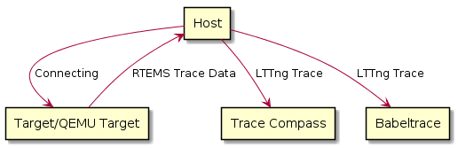

.. SPDX-License-Identifier: CC-BY-SA-4.0

.. Copyright (C) 2019 embedded brains GmbH
.. Copyright (C) 2019 Sebastian Huber
.. Copyright (C) 2019 Ravindra Kumar Meena

.. _EventRecording:

Event Recording
***************

The `event recording` support focuses on the recording of high frequency
events such as

     * thread switches,
     * thread queue enqueue and surrender,
     * interrupt entry and exit,
     * heap/workspace memory allocate/free,
     * UMA zone allocate/free,
     * Ethernet packet input/output, and
     * etc.

There is a fixed set of 512 system reserved and 512 user defined events which
are identified by an event number (:c:type:`rtems_record_event`).

The event recording support allows post-mortem analysis in fatal error
handlers, e.g. the last events are in the record buffers, the newest event
overwrites the oldest event.  It is possible to detect record buffer overflows
for consumers that expect a continuous stream of events, e.g. to display the
system state changes in real-time.

The implementation supports high-end SMP machines (more than 1GHz processor
frequency, more than four processors).  It uses per-processor ring buffers to
record the events.  Synchronization is done without atomic read-modify-write
operations.  The CPU counter is used to get the time of events. It is combined
with periodic uptime events to synchronize it with the monotonic system clock
(:c:macro:`CLOCK_MONOTONIC`).

The application must configure the event recording via the configuration options
:c:macro:`CONFIGURE_RECORD_PER_PROCESSOR_ITEMS` and
:c:macro:`CONFIGURE_RECORD_EXTENSIONS_ENABLED`.

Events can be recorded for example with the :c:func:`rtems_record_produce`
function.

.. code-block:: c

    #include <rtems/record.h>

    void f( void )
    {
      rtems_record_produce( RTEMS_RECORD_USER( 0 ), 123 );
    }

Recorded events can be sent to a host computer with a very simple record server
started by :c:func:`rtems_record_start_server` via a TCP connection.

On the host computer you may use the command line tool
:file:`rtems-record-lttng` to get recorded events from the record server
running on the target system.

.. _tracecompass:

Trace Compass
=============

`Trace Compass <https://www.eclipse.org/tracecompass/>`_ is a tool to analyze
and display trace data graphically. Trace data can be gathered from RTEMS
applications via various means, for example:

- :ref:`RTEMS Trace Linker <TraceLinker>`
- :ref:`RTEMS Capture Engine <CaptureEngine>`
- :ref:`RTEMS Event Recording <EventRecording>`

Event Recording Infrastructure is used to analyze and display some basic
information. The basic information is defined by the Linux kernel trace
support (`LTTng <https://lttng.org/>`_) and includes CPU Usage, IRQ Analysis
(IRQ Statistics, IRQ Table etc.)

Event Recording Infrastructure generates the trace stream and converted into
`LTTng <https://lttng.org/>`_ format at host which is easily understood by
`Trace Compass <https://www.eclipse.org/tracecompass/>`_.

This scheme of tracing goes through the flow of events described in a
subsequent flowchart.

.. topic:: Steps:

  1. The QEMU simulator is used to run a LibBSD based application and connect
     it to a virtual network on host. This requires to create a TAP virtual
     Ethernet interface for this. The QEMU command line is used for board
     support package, e.g the arm/xilinx_zynq_a9_qemu BSP etc.

  2. On the host computer the command line tool :file:`rtems-record-lttng` can
     be used to get recorded events from the record server running on the
     target system. Recorded events can be sent to a host computer with a very
     simple record server started by :c:func:`rtems_record_start_server` via a
     TCP connection.

  3. The trace data received at host from QEMU target is converted into
     `LTTng <https://lttng.org/>`_ format. The
     `Babeltrace <https://diamon.org/babeltrace/>`_ and
     `Trace Compass <https://www.eclipse.org/tracecompass/>`_ are two
     compatible software which can read `LTTng <https://lttng.org/>`_ trace.
     The converted `LTTng <https://lttng.org/>`_ trace can be passed to any of
     these softwares.

RTEMS LTTng Trace Generation Example
====================================

.. topic:: Steps:

  1. :file:`rtems-record-lttng` tool is available in RSB for tracing. Follow
     :ref:`quick start <QuickStart>` to install the tool and set up
     `rtems-libbsd <https://github.com/RTEMS/rtems-libbsd>`_ necessary to work
     with this example, if havn't done already. We have chosen
     :file:`$HOME/development/rtems/5` as the installation :ref:term:`prefix`.

  2. The QEMU command line varies by board support package, here is an example
     for the arm/xilinx_zynq_a9_qemu BSP:

  .. code-block:: shell

    cd rtems-libbsd

    qemu-system-arm -serial null -serial mon:stdio -nographic \
    -M xilinx-zynq-a9 -m 256M \
    -net tap,ifname=qtap,script=no,downscript=no \
    -net nic,model=cadence_gem,macaddr=0e:b0:ba:5e:ba:12 \
    -kernel build/arm-rtems5-xilinx_zynq_a9_qemu-default/media01.exe

  3. This requires to TAP virtual Ethernet interface for this. The follwoing
     command are used to TAP virtual Ethernet interface which has been run on
     Linux host:

  .. code-block:: shell

    sudo tunctl -p -t qtap -u $(whoami)
    sudo ip link set dev qtap up
    sudo ip addr add 169.254.1.1/16 dev qtap

  After the target has booted it will acquire a IPv4 link-local address, e.g.

  .. code-block:: shell

    info: cgem0: probing for an IPv4LL address
    debug: cgem0: checking for 169.254.XXX.XXX

  4. After successfully connected to the target, the trace can be generated by
     target by the following command:

  .. code-block:: shell

    $HOME/development/rtems/5/bin/rtems-record-lttng -H 169.254.XXX.XXX -p 1234

  Alternatively, if user have the raw-data then the trace can be generated
  from raw data without TCP connection by following command:

  .. code-block:: shell

    $HOME/development/rtems/5/bin/rtems-record-lttng --input=<raw-data-path>

  Here, <raw-data-path> is the path of raw data. Raw-data is a stream file
  which can be obtained via `nc <https://linux.die.net/man/1/nc>`_ tool.

  5. Set up the `Trace Compass <https://www.eclipse.org/tracecompass/>`_ and
     install the `Add-Ons
     <https://github.com/tuxology/tracevizlab/tree/master/labs/006-installing-tracecompass#task-3-install-the-required-add-ons-for-this-tutorial>`_
     , if haven't done already.

  6. The `Babeltrace <https://diamon.org/babeltrace/>`_ and
     `Trace Compass <https://www.eclipse.org/tracecompass/>`_ are two
     compatible software which can read `LTTng <https://lttng.org/>`_ trace.
     This step demonstrates the trace visualization in
     `Trace Compass <https://www.eclipse.org/tracecompass/>`_:

     Move the trace from target or raw-data and metadata generated in common
     folder, e.g CTF folder and follow the steps given `here
     <https://github.com/tuxology/tracevizlab/tree/master/labs/006-installing-tracecompass#task-4-import-the-traces-for-the-tutorial>`_
     to import the `LTTng <https://lttng.org/>`_ trace.

     All the trace and LTTng metadata for trace has to be moved in single
     folder because babeltrace and Trace Compass needs a directory where only
     trace and metadata are present, if other files which are not related to
     trace are found in directory then the above software will print error.

     Currently, `Trace Compass <https://www.eclipse.org/tracecompass/>`_ can
     only display a proper CPU Load, Resources view and thread state
     (IDLE/RUNNING) with thread names in trace visualization.

     Alternatively, `Babeltrace <https://diamon.org/babeltrace/>`_ can be used
     if user is only interested in reading the `LTTng <https://lttng.org/>`_
     trace. Move the trace and metadata generated in common folder, e.g CTF
     folder and run following command:

  .. code-block:: shell

    cd CTF
    babeltrace .

  The `Babeltrace <https://diamon.org/babeltrace/>`_ output should look
  something like this:

  .. code-block:: shell

    [19:22:08.679021917] (+0.000004377) Record_Item sched_switch:
    { cpu_id = 4 }, { prev_comm = "IRQS", prev_tid = 167837706, prev_prio = 0,
    prev_state = 0, next_comm = "IDLE", next_tid = 0, next_prio = 0 }
    [19:22:08.679022700] (+0.000000783) Record_Item sched_switch:
    { cpu_id = 5 }, { prev_comm = "IRQS", prev_tid = 167837707, prev_prio = 0,
    prev_state = 0, next_comm = "IDLE", next_tid = 0, next_prio = 0 }
    [19:22:08.679030770] (+0.000008070) Record_Item sched_switch:
    { cpu_id = 4 }, { prev_comm = "IDLE", prev_tid = 0, prev_prio = 0,
    prev_state = 1026, next_comm = "IDLE", next_tid = 0, next_prio = 0 }

  The above output displays the timestamp, thread state (IDLE/RUNNING), cpu_id
  etc.
